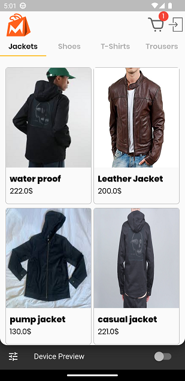

# mody_ecommerce

A fully functional e-commerce app built with Flutter and Firebase

<h2> Splash </h2>
 
</img>

<h2> Login Page </h2>
 
</img>
 

   
<h2> Sign Up </h2>
 
</img>
    
<h2> Home Page user </h2>
 
</img>
     
<h2> Single Item </h2>
 
</img>
      
<h2> User toast </h2>
 
</img>

<h2> Cart page</h2>
 
</img>

<h2> Place order</h2>
 
</img>

<h2> Admin home</h2>
 
</img>

<h2> Add product</h2>
 
</img>

<h2> Manage Products</h2>
 
</img>

<h2> Edit Product</h2>
 
</img>

<h2> Orders</h2>
 
</img>

<h2> Order details</h2>
 
</img>

